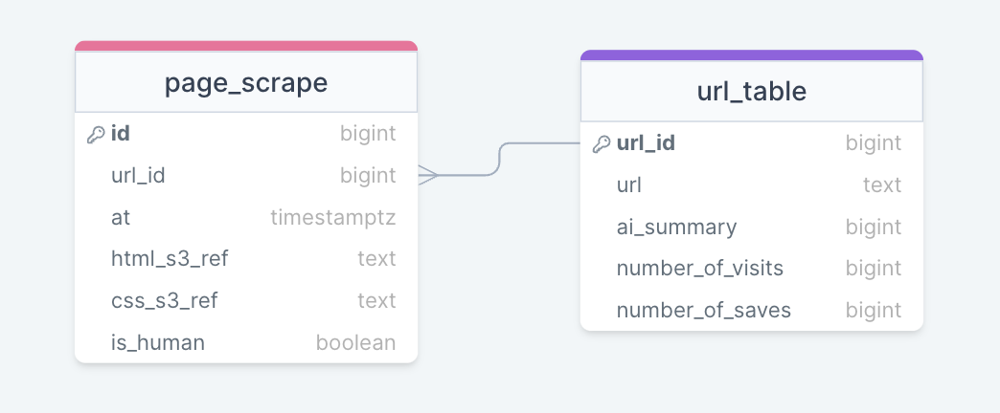

# Internet Archiver
For this project, a website was created which can take inputs of website urls and scrape those pages. This data is then stored and can be redisplayed on the website when requested. A dashboard of the most popular websites to archive and other data was created. Each website is scraped again after 3 hours and all past versions are visible.

## Setup and Installation
For some folders there will be a `requirements.txt` file. Once in the folder, you can run the following command:
- `pip3 install -r requirements.txt`

A `.env` is required in every folder containing:
- DB_NAME
- DB_IP
- DB_PORT
- DB_USERNAME
- DB_PASSWORD
- AWS_ACCESS_KEY_ID
- AWS_SECRET_ACCESS_KEY
- S3_BUCKET
- OPENAI_API_KEY 

A `terraform.tfvars` is required in the terraform folder containing:
- S3_BUCKET
- DB_IP
- DB_PORT
- DB_NAME
- DB_USERNAME
- DB_PASSWORD
- AWS_ACCESS_KEY_ID
- AWS_SECRET_ACCESS_KEY
- URL_TABLE_NAME
- SCRAPE_TABLE_NAME
- AWS_GROUP
- AWS_REGION
- AWS_STREAM_PREFIX

## Files
### Api Folder
- `app.py`: A python script containing the main application, which makes the internet archiver website.
- `chat_gpt_utils.py`: A python script which creates a genre and summary of a website using chatGPT.
- `connect.py`: A python script containing functions to connect to the database.
- `download_from_s3.py`: A python script which downloads css and html files from an s3 bucket.
- `upload_to_s3.py`: A python script which uploads css and html files to an s3 bucket.
- `extract_from_database.py`: A python script which extracts url data from a database.
- `upload_to_database.py`: A python script which uploads url data from a database.
- `requirements.txt`: A text file containing the required python libraries to run the website.
- `DockerFile`: A docker file used to collate the app into an image.

### Dashboard
- `dashboard_functions.py`: A python script containing the functions to make the dashboard.
- `download_screenshot.py`: A python script containing the functions to download a website screenshot from an s3 bucket.
- `extract.py`: A python script containing the functions to extract data from the database.
- `dashboard.py`: A python script that creates the dashboard when run.
- `DockerFile`: A docker file used to collate the dashboard into an image.

### Database Folder
- `schema.sql`: An SQL script that creates all the tables in the database.
- `reset_schema.sh`: A bash script that runs `schema.sql` to produce the tables.
- `login.sh`: A bash script that logs into the database for debugging purposes.

### Terraform Folder
- `main.tf`: A terraform script that creates the project architecture in AWS.
- `variable.tf`: A terraform script containing the necessary variables for `main.tf`.

### WebScraper Folder
- `extract.py`: A python script that extracts url data from the database.
- `load.py`: A python script used to insert the re-scraped HTML and CSS files into the S3 bucket.
- `pipeline.py`: A python script that web scrapes the non-duplicate URLs contained in the S3 bucket.
- `test_extract.py`: A python script containing unit tests for the extract.py file.
- `test_load.py`: A python script containing unit tests for the load.py file.
- `Dockerfile`: A docker file used to collate the pipeline into an image.
- `requirements.txt`: A text file containing the required python libraries to run the pipeline.

## Architecture Diagrams

### Overall Simplified Diagram

### Automatic Web Scraper

### Internet Archiver Website

### Automatic Web Scraper

## ERD Diagram
